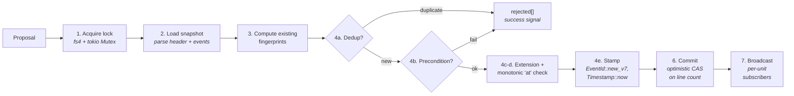
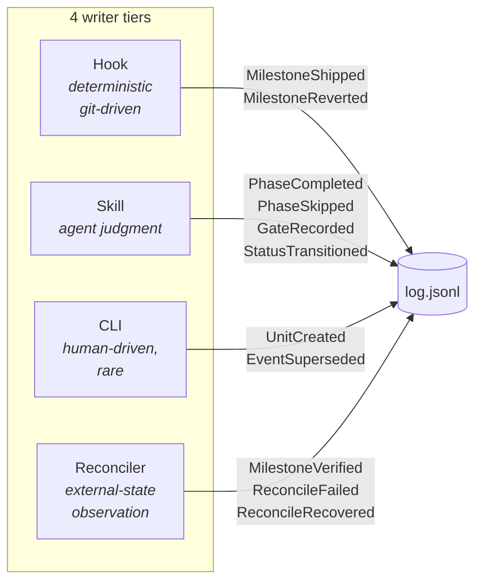
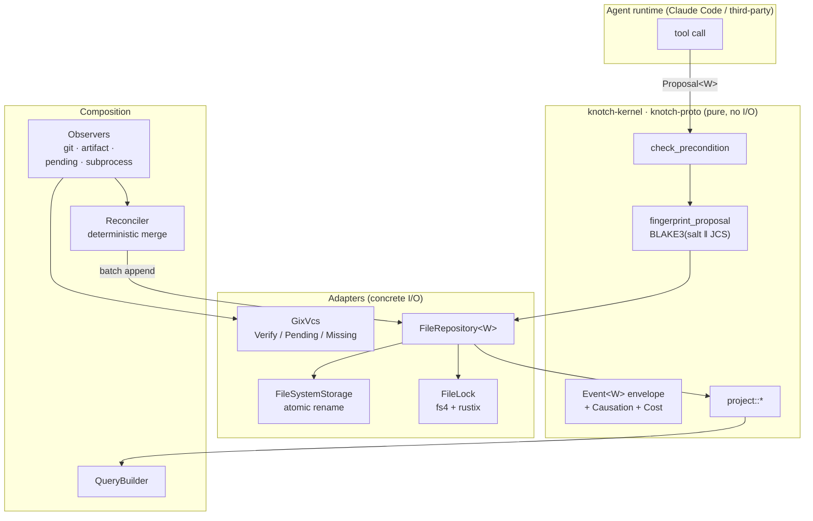

# Knotch

[](https://www.rust-lang.org)
[](https://doc.rust-lang.org/edition-guide/)
[](#품질-게이트)
[](#라이선스)

> **[English](README.md)** | **한국어**

> **Git 상관 이벤트 소싱 워크플로우 상태 — AI 에이전트를 위해 설계됨.**

Knotch 는 Rust 라이브러리이자 `knotch` CLI 입니다. AI 에이전트에게
워크플로우 상태를 관리할 단일하고 감사 가능한 표면을 제공합니다.
에이전트가 수행하는 모든 행동은 불변 이벤트로 기록되고, 모든 읽기는
그 이벤트 로그에 대한 순수 projection 입니다. 로그를 쓰는 경로는
하나뿐이며, 커널은 I/O 를 전혀 수행하지 않기 때문에 replay 후에도
불변 조건이 유지됩니다.

---

## 빠른 시작

```bash
# 1. 바이너리 + Claude Code 플러그인 설치 (macOS / Linux)
curl -fsSL https://raw.githubusercontent.com/knotch-rs/knotch/main/scripts/install.sh | bash

# 2. 프로젝트에 워크스페이스 스캐폴딩
knotch init --with-hooks

# 3. unit 생성 후 phase 완료 기록
knotch unit init feat-auth
knotch mark completed specify
knotch gate g0-scope pass "scope bounded to OAuth2 password grant"

# 4. 상태 조회
knotch show feat-auth               # projection 요약
knotch show feat-auth --format json # 기계 판독용
knotch log feat-auth                # 원본 이벤트 스트림
```

모든 명령어는 `--json` (기계 출력) 과 `--quiet` 전역 플래그를 지원하며,
각 하위 커맨드가 두 플래그를 균일하게 처리합니다.

---

## 무엇을 해주는가

- **상태 파일이 아닌 원장.** 각 unit 의 히스토리는 추가 전용 JSONL
  로그입니다. 상태 / 페이즈 / 마일스톤은 로그에서 **projection 으로
  파생**됩니다 — drift 가 발생할 수 있는 `state.json` 같은 파일은
  존재하지 않습니다.
- **구조적 멱등성.** 모든 proposal 은 content-addressed 됩니다
  (RFC 8785 JCS canonical 형식 위의 BLAKE3 해시). 같은 proposal 을
  재시도하면 `rejected: [{ reason: "duplicate" }]` 가 반환됩니다 —
  이것은 **at-least-once 전달의 성공 신호**이며 에러가 아닙니다.
- **Agent-first observability.** 모든 이벤트는 `Causation` 체인을
  담습니다 (agent id, 모델, harness, 세션 id, trace id, 툴콜 id,
  비용). `knotch-tracing` 은 이 정보를 구조화된 span 으로 방출하므로
  외부 observability (OTel, Prometheus) 가 동일한 id 들로 join
  가능합니다.
- **Git 과의 상관.** 마일스톤은 `Knotch-Milestone: <id>` git trailer 로
  커밋에 연결되고, revert 는 `knotch hook record-revert` 로 노출되며,
  reconciler 가 pending 상태의 커밋이 main 브랜치에 도달하면
  verified 로 승격시킵니다.

## 무엇이 아닌가

- **태스크 트래커가 아닙니다.** unit 은 slug 기반 원장이지 티켓
  시스템이 아닙니다. 마일스톤은 커밋 trailer 로 명시적으로
  이름을 붙입니다 — knotch 는 free-form 메시지에서 마일스톤을
  임의로 만들어내지 않습니다.
- **시크릿 스캐너가 아닙니다.** 커밋 메시지는 로그에 그대로
  기록됩니다. `knotch hook check-commit` 앞단에 gitleaks / trufflehog /
  detect-secrets 를 걸어두세요. 스캐너가 설정되지 않으면
  `knotch doctor` 가 경고합니다.
- **문서 저장소가 아닙니다.** artifact 경로는 참조일 뿐이며, 실제
  파일은 프로젝트 레포지토리에 남습니다.
- **워크플로우 엔진이 아닙니다.** 스코프 계약은
  [`.claude/rules/governance.md`](.claude/rules/governance.md) 에
  정의되며, 대시보드 / 템플릿 카탈로그 / 비즈니스 정책 / 프로젝트
  브랜디드 룰을 모두 veto 합니다. knotch 는 원장의 구조적
  primitive 만 제공합니다.

---

## 동작 원리

### 스냅샷이 아닌 이벤트

대부분의 워크플로우 도구는 unit 의 *현재 상태* 를 하나의 파일
(`state.json`, 데이터베이스 행, YAML 블록) 에 저장합니다. 매번 write
가 이전 진실을 덮어씁니다. 여기서 세 가지 실패 모드가 발생합니다:

| 스냅샷 모델 | 이벤트 소싱 모델 (knotch) |
|---|---|
| 동시 writer 두 개가 경쟁하며 업데이트를 잃음 | 라인 카운트에 대한 optimistic CAS — 두 번째 writer 는 최신 로그에 대해 재시도 |
| 상태 롤백에 감사 흔적이 남지 않음 | `EventSuperseded` 가 불변 롤백 이벤트로 방출됨 |
| "누가 이것을 결정했는가?" 가 복구 불가 | 모든 이벤트는 `Causation` 을 담음 — principal, 세션, 트리거, 비용 |
| 파일 간 silent divergence (status.md vs status.json) | Markdown frontmatter 는 원장의 projection — `knotch-frontmatter` 가 동기화 |

### Append 경로

`Repository::append` 를 통한 모든 write 는 unit 의 락을 쥔 채 아래
순서대로 수행됩니다. 이 순서는 어댑터가 강제하며
[`.claude/rules/append-flow.md`](.claude/rules/append-flow.md) 에
검증됩니다.



1. **락 획득** — `FileLock` (프로세스 간: `fs4` advisory lock +
   `rustix` stale-lease 감지) + 프로세스 내: 단위별
   `tokio::sync::Mutex`.
2. **스냅샷 로드** — JSONL 로그 헤더 + 이벤트 파싱.
3. **기존 fingerprint 계산** — dedup 을 위함.
4. **각 proposal 마다** (순서가 중요):
   - **Dedup 먼저** — fingerprint 가 이미 존재하면 `rejected` 에
     `"duplicate"` 이유와 함께 추가.
   - **Precondition** — `EventBody::check_precondition` 이 variant 별
     로 디스패치 (자세히:
     [`.claude/rules/preconditions.md`](.claude/rules/preconditions.md)).
   - **Extension precondition** — `ExtensionKind::check_extension`.
   - **Monotonic `at`** — `stamp_monotonic(&clock, last_at)` 을
     통해 `at` 가 항상 마지막 이벤트보다 엄격히 크게 찍힘. NTP
     보정·VM suspend 등 벽시계 역행에도 자가복구.
   - **Stamp + working log 에 추가** — 다음 proposal 이 그 상태를
     보고 검증할 수 있도록.
5. **All-or-nothing rollback** — `AppendMode::AllOrNothing` 에서
   하나라도 rejection 이 있으면 전체 배치 폐기.
6. **Commit** via `Storage::append(unit, expected_len, lines)`.
   `expected_len` 에 대한 optimistic CAS — 로그를 연장한 동시 writer
   가 있으면 `LogMutated` 를 반환, 호출자가 재시도.
7. **Broadcast** 를 unit 별 subscriber 에게. receiver 없으면 무시.

`knotch-linter` 룰 **R1** (`DirectLogWriteRule`) 은 `knotch-storage`
외부의 어떤 crate 도 `log.jsonl` 에 직접 write 하는 것을 정적으로
금지합니다. 리뷰가 아닌 **빌드 실패**로 막습니다.

### Writer 는 4개의 tier 로 구분

모든 `EventBody` variant 는 단 하나의 canonical emitter 를 가집니다.
[`.claude/rules/event-ownership.md`](.claude/rules/event-ownership.md)
의 표가 authoritative 입니다.



| Tier | 트리거 | 예시 |
|---|---|---|
| **Hook** | git 명령어 완료 | `Knotch-Milestone:` trailer 가 있는 `git commit` → `MilestoneShipped` |
| **Skill** | 에이전트가 `/knotch-*` 호출 | `/knotch-mark completed implement` → `PhaseCompleted` |
| **CLI** | 사람이 `knotch <cmd>` 실행 | `knotch supersede <event-id> "..."` → `EventSuperseded` |
| **Reconciler** | observer 가 외부 상태 관찰 | `PendingCommitObserver` 가 `Pending` → `Verified` 승격 |

다른 writer 는 없습니다. Tier 분리는 기계적으로 강제됩니다: hook 과
skill 은 `knotch-agent` 헬퍼를 경유하고, CLI 는 동일 헬퍼에
바인딩되며, `Repository::append` 가 네 tier 를 모두 거치는 유일한
진입점입니다.

### 읽기는 projection

모든 read API 는 로그 위의 순수 함수입니다:

- `knotch_kernel::project::current_phase(&W, &log) -> Option<W::Phase>`
- `knotch_kernel::project::current_status(&log) -> Option<StatusId>`
- `knotch_kernel::project::shipped_milestones(&log) -> BTreeSet<W::Milestone>`
- `knotch_kernel::project::total_cost(&log) -> Cost`

`knotch-query` crate 는 cross-unit `QueryBuilder<W>` 를 노출하며,
`knotch-tracing` 은 append 당 구조화된 span 을 방출합니다. 지속 업데이트를
구독할 에이전트는 `Repository::subscribe(unit) -> impl Stream<Item =
SubscribeEvent<W>>` 를 사용합니다.

### 아키텍처

knotch 는 hexagonal ports-and-adapters 패턴을 따릅니다.
`knotch-kernel` 은 pure 합니다 — `knotch-linter` 룰 **R3**
(`KernelNoIoRule`) 이 kernel + proto crate 에서 `std::fs`, `std::net`,
`tokio::fs`, `tokio::net`, `gix` 임포트를 금지합니다. 어댑터는 포트를
구현하고, composition crate 가 이들을 조립합니다.



**하나의 제네릭 파라미터가 모든 API 에 관통**합니다: `W: WorkflowKind`
(`Phase`, `Milestone`, `Gate`, `Extension` associated type 을 담음).
별도 네 개의 bound 가 아닌 — RFC 0002 "single bound" 설계입니다.

### 워크스페이스 레이아웃

```
knotch/
├── crates/
│   ├── knotch-kernel/        # Pure: Event<W>, Repository, precondition, projection
│   ├── knotch-proto/         # Pure: 와이어 포맷, JCS, schema versioning
│   ├── knotch-derive/        # WorkflowKind 보일러플레이트용 proc-macro
│   ├── knotch-storage/       # 어댑터: JSONL FileSystemStorage + FileRepository
│   ├── knotch-lock/          # 어댑터: 프로세스 간 FileLock (fs4 + rustix)
│   ├── knotch-vcs/           # 어댑터: GixVcs (pure-Rust git, C 의존성 없음)
│   ├── knotch-workflow/      # 정식 Knotch 워크플로우 + ConfigWorkflow 런타임
│   ├── knotch-schema/        # Tier-5: FrontmatterSchema + LifecycleFsm
│   ├── knotch-frontmatter/   # Tier-5: Markdown ↔ 원장 status 동기화
│   ├── knotch-adr/           # Tier-5: ADR lifecycle WorkflowKind
│   ├── knotch-observer/      # Observer trait + git/artifact/pending/subprocess
│   ├── knotch-reconciler/    # 결정론적 observer composition
│   ├── knotch-query/         # Cross-unit QueryBuilder + LLM summary
│   ├── knotch-tracing/       # Attribute schema + span helper
│   ├── knotch-linter/        # cargo knotch-linter (R1/R2/R3 enforcement)
│   ├── knotch-agent/         # Claude Code hook/skill 통합 라이브러리
│   ├── knotch-cli/           # `knotch` 레퍼런스 바이너리
│   └── knotch-testing/       # 개발용: InMemoryRepository + simulation harness
├── examples/                 # Minimal, pr-workflow, compliance, case-study 2종, …
├── plugins/knotch/           # Claude Code 플러그인 번들 (hooks/ + skills/)
├── .claude/rules/            # 구조적 불변 조건 (path-scoped rule 파일)
├── .claude/skills/           # 에이전트 스킬 (knotch-{mark,gate,query,transition})
├── docs/public_api/          # Public-API baseline (라이브러리 crate 별)
├── docs/migrations/          # 어답터 migration playbook
└── xtask/                    # cargo xtask {ci,docs-lint,public-api,plugin-sync}
```

각 `crates/<name>/CLAUDE.md` 가 그 crate 의 역할 + 확장 레시피를
담습니다. 크레이트별 구조 룰은 `.claude/rules/` 에서 `@`-import
되므로 Claude 는 현재 다루는 파일과 관련된 내용만 로드합니다.

---

## CLI

```bash
# 워크스페이스 lifecycle
knotch init [--with-hooks] [--demo]      # knotch.toml + state/ + .knotch/ 스캐폴딩
knotch doctor                            # 헬스 체크 (룰 파일, 환경 변수, observer)
knotch migrate                           # schema-version 감지
knotch completions <bash|zsh|fish|…>     # 쉘 completion

# Unit 관리
knotch unit init <id>                    # unit 디렉토리 생성
knotch unit use <id>                     # active unit 지정 (.knotch/active.toml)
knotch unit list                         # 알려진 unit 열거
knotch unit current                      # 현재 active unit slug 출력
knotch current                           # `unit current` 의 alias

# 읽기 / 재생
knotch show <unit> [--format summary|brief|raw|json]
knotch log <unit>                        # 원본 JSONL 이벤트 스트림
knotch reconcile [--prune] [--prune-older <HOURS>] [--queue-only] [--unit <id>]

# 쓰기 (사람 중심, 드문 작업)
knotch supersede <event-id> <rationale>

# 쓰기 (스킬 중심 — /knotch-* 스킬이 이들로 shell out)
knotch mark <completed|skipped> <phase> [--artifact <path>]... [--reason <text>]
knotch gate <gate-id> <decision> <rationale>
knotch transition <target> [--forced --reason <text>]

# Claude Code hook 디스패치 (stdin JSON)
knotch hook <load-context|check-commit|verify-commit|record-revert|
             guard-rewrite|record-subagent|refresh-context|finalize-session>
```

`--json` 과 `--quiet` 는 **전역** 플래그이며, 모든 하위 커맨드가
동일하게 처리합니다.

---

## 설치

### 빠른 설치 (권장)

**macOS / Linux**
```bash
curl -fsSL https://raw.githubusercontent.com/knotch-rs/knotch/main/scripts/install.sh | bash
```

**Windows (PowerShell 7+)**
```powershell
iwr -useb https://raw.githubusercontent.com/knotch-rs/knotch/main/scripts/install.ps1 | iex
```

인스톨러는 플랫폼을 감지하고, prebuilt 바이너리 + Claude Code 플러그인
번들을 다운로드하며, SHA256 를 검증하고, `$HOME/.local/bin` (POSIX)
또는 `$USERPROFILE\.local\bin` (Windows) 에 설치합니다. 필요하다면
플러그인을 `~/.claude/plugins/knotch` 에 함께 설치합니다. 터미널에서는
완전 인터랙티브 모드로 동작하며, CI 용으로 `--yes` 를 지원합니다.

### 지원 플랫폼

| OS | 아키텍처 | Target triple |
|---|---|---|
| Linux | x86_64 | `x86_64-unknown-linux-musl` (정적) |
| Linux | arm64 | `aarch64-unknown-linux-musl` (정적) |
| macOS | Intel + Apple Silicon | `universal-apple-darwin` (fat binary, ad-hoc codesign) |
| Windows | x86_64 | `x86_64-pc-windows-msvc` |

### 인스톨러 플래그

```
--version VERSION              특정 버전 설치 (기본: latest)
--install-dir PATH             바이너리 위치 (기본: $HOME/.local/bin)
--plugin user|project|none     플러그인 설치 레벨 (기본: user)
--from-source                  다운로드 대신 소스 빌드
--force                        기존 설치를 프롬프트 없이 덮어씀
--yes, -y                      비대화형 (모든 기본값 수용)
--dry-run                      계획만 출력, 실행하지 않음
```

모든 플래그는 대응하는 `KNOTCH_*` 환경 변수 (`KNOTCH_VERSION`,
`KNOTCH_INSTALL_DIR`, `KNOTCH_PLUGIN_LEVEL`, `KNOTCH_FROM_SOURCE`,
`KNOTCH_FORCE`, `KNOTCH_YES`, `KNOTCH_DRY_RUN`) 를 가집니다. ANSI 색상을
끄려면 `NO_COLOR=1` 을 설정하세요. 우선 순위는 flag > env > 기본값
입니다.

### cargo-binstall

```bash
cargo binstall knotch-cli
```

`crates/knotch-cli/Cargo.toml` 의 `[package.metadata.binstall]` 에 의해
인스톨 스크립트가 받는 동일한 prebuilt 아카이브를 다운로드합니다.

### 체크섬 검증이 포함된 수동 설치

```bash
VERSION=0.1.0
TARGET=x86_64-unknown-linux-musl
BASE="https://github.com/knotch-rs/knotch/releases/download/v$VERSION"
curl -fLO "$BASE/knotch-v$VERSION-$TARGET.tar.gz"
curl -fLO "$BASE/knotch-v$VERSION-$TARGET.tar.gz.sha256"
shasum -a 256 -c "knotch-v$VERSION-$TARGET.tar.gz.sha256"
tar -xzf "knotch-v$VERSION-$TARGET.tar.gz"
install -m 755 knotch "$HOME/.local/bin/knotch"
```

모든 릴리스 아티팩트에는 SLSA build provenance
(`actions/attest-build-provenance`) 가 추가로 서명됩니다 —
`gh attestation verify <archive>.tar.gz --owner knotch-rs` 로 검증할 수
있습니다.

### 소스에서 빌드

```bash
git clone https://github.com/knotch-rs/knotch
cd knotch
./scripts/install.sh --from-source
# 또는: cargo install --path crates/knotch-cli --locked
```

### 제거

```bash
# macOS / Linux
curl -fsSL https://raw.githubusercontent.com/knotch-rs/knotch/main/scripts/uninstall.sh | bash

# Windows
iwr -useb https://raw.githubusercontent.com/knotch-rs/knotch/main/scripts/uninstall.ps1 | iex
```

---

## 품질 게이트

모든 push 에 대해 아래 항목이 실행되며 실패 시 merge 가 차단됩니다.

| 게이트 | 명령어 | 목적 |
|---|---|---|
| 포맷 | `cargo +nightly fmt --all --check` | nightly rustfmt 가 `rustfmt.toml` 의 unstable key (import grouping, comment wrap) 를 적용 |
| Lint | `cargo clippy --workspace --all-targets --all-features -- -D warnings` | stable + beta 툴체인에서 `-D warnings` |
| 테스트 | `cargo nextest run --workspace --all-features` + `cargo test --workspace --all-features --doc` | ubuntu / macos / windows × stable / beta, 그리고 MSRV 게이트를 겸하는 `ubuntu / 1.94 MSRV` 행 |
| 커버리지 | `cargo llvm-cov` | Codecov 로 업로드 |
| 구조 lint | `cargo knotch-linter` | R1 (DirectLogWriteRule), R2 (FingerprintAlgorithmRule), R3 (KernelNoIoRule) |
| 미사용 dep | `cargo machete` | 워크스페이스 전체 |
| 보안 | `cargo deny check` | 라이선스 allowlist + CVE 권고 |
| Semver | `cargo semver-checks` | patch / minor / major 분류, 버전 범프 불일치 시 실패 |
| Public API | `cargo public-api --diff-against docs/public_api/<crate>.baseline` | 표면 변경 시 동일 commit 에서 baseline 갱신 필요 |
| 문서 인용 | `cargo xtask docs-lint` | `.claude/rules/` 의 `crate/path.rs:LINE` 인용이 여전히 resolve 되는지 |
| Fuzzing | `cargo fuzz` (nightly workflow, target 당 3600초) | 매일 예약 실행 |
| 설치 | `install-test.yml` | 3-OS × (from-source + prebuilt) 샌드박스 왕복 검증 |

`#![forbid(unsafe_code)]` 가 `Cargo.toml [workspace.lints.rust]` 에
워크스페이스 단위로 선언되어 있습니다. 예외는 없습니다 — 2026
safe-wrapper 스택 (`rustix`, `fs4`, `gix`) 이 모든 저수준 관심사를
커버합니다.

---

## 설정

### `knotch.toml`

```toml
# unit 별 로그가 위치할 디렉토리 (knotch.toml 기준 상대 경로).
state_dir = "state"
schema_version = 1

# guard-rewrite 정책. history 를 재작성하는 git 커맨드를
# hook 이 어떻게 처리할지 제어.
[guard]
rewrite = "warn"   # warn | block | off

# 이 프로젝트가 따르는 lifecycle. 기본값은 정식 Knotch 워크플로우;
# 도메인에 맞게 자유롭게 수정 가능.
[workflow]
name = "knotch"
schema_version = 1
terminal_statuses = ["archived", "abandoned", "superseded", "deprecated"]
known_statuses = [
    "draft", "in_progress", "in_review", "shipped",
    "archived", "abandoned", "superseded", "deprecated",
]

[workflow.required_phases]
tiny = ["specify", "build", "ship"]
standard = ["specify", "plan", "build", "review", "ship"]

[[workflow.phases]]
id = "specify"
# ... plan / build / review / ship

# 옵션: subprocess observer — `knotch reconcile` 중 각 바이너리로
# shell out. stdin 은 JSON ObserverContext, stdout 은
# JSON Vec<Proposal<W>>.
[[observers]]
name = "artifact-scan"
binary = "./tools/artifact-scan.py"
```

### 환경 변수

| 변수 | 소비자 | 기본값 |
|---|---|---|
| `KNOTCH_ROOT` | 전역 `--root` 오버라이드 | cwd 에서 `knotch.toml` 까지 상위 탐색 |
| `KNOTCH_UNIT` | active-unit 해결 (hook 체인의 최우선) | `.knotch/sessions/<id>.toml` → `.knotch/active.toml` |
| `KNOTCH_MODEL` | `hook_causation.principal.model` | `"unknown"` |
| `KNOTCH_HARNESS` | `hook_causation.principal.harness` | `"claude-code"` |

쉘 프로파일 (또는 `.envrc`) 에 `KNOTCH_MODEL` + `KNOTCH_HARNESS` 를
export 하면, hook 이 방출하는 모든 이벤트에 정확한 attribution 이
기록됩니다. 이 두 값이 없으면 downstream 의 "어떤 모델이 무엇을 했나"
질의가 `"unknown"` 으로 붕괴합니다. 두 값이 설정되지 않으면
`knotch doctor` 가 경고합니다.

### Guard 정책

`knotch.toml` 의 `[guard]` 섹션은 history 를 재작성하는 git 커맨드를
`guard-rewrite` hook 이 어떻게 처리할지 제어합니다
(`push --force`, `reset --hard`, `branch -D`, `checkout --`,
`clean -f`, `rebase -i/--root`):

| 정책 | 동작 |
|---|---|
| `warn` (기본) | Claude 가 context 에 경고 받음; 명령은 실행됨 |
| `block` | Hook 이 exit 2; 명령 취소 |
| `off` | 무음 no-op — 개인 실험 / 버려질 브랜치용 |

`git push --force-with-lease` 는 항상 예외 — Git 의 안전한 atomic-CAS
push 이기 때문입니다.

---

## 에이전트 통합

이 레포를 읽는 AI 에이전트라면 [`CLAUDE.md`](CLAUDE.md) 에서
시작하세요 — `.claude/rules/` 와 `.claude/skills/` 로 연결되는
progressive-disclosure 진입점입니다. 모든 주장은 `crate/path.rs:LINE`
인용으로 뒷받침되며 매 커밋마다 `cargo xtask docs-lint` 가 검증합니다.

- [`.claude/skills/knotch-query/SKILL.md`](.claude/skills/knotch-query/SKILL.md) — projection 읽기
- [`.claude/skills/knotch-mark/SKILL.md`](.claude/skills/knotch-mark/SKILL.md) — phase 완료 / 스킵 기록
- [`.claude/skills/knotch-gate/SKILL.md`](.claude/skills/knotch-gate/SKILL.md) — gate 결정 기록
- [`.claude/skills/knotch-transition/SKILL.md`](.claude/skills/knotch-transition/SKILL.md) — unit status 전환
- [`.claude/rules/hook-integration.md`](.claude/rules/hook-integration.md) — hook exit-code 계약
- [`.claude/rules/event-ownership.md`](.claude/rules/event-ownership.md) — variant 별 소유자 표

써드파티 harness 는 `knotch-cli` 를 래핑하기보다 `knotch-agent` 를
자체 바이너리에서 직접 임베드합니다. Hook 계약은 동일합니다 —
바이너리는 달라도 라이브러리는 같습니다.

자체 상태 레이어에서 마이그레이션하는 adopter 는
[`docs/migrations/README.md`](docs/migrations/README.md) 의 phased
패턴을 따릅니다. 기존 계획은 각 repo 에 있습니다: Grove
(`grove/docs/migration/knotch-migration-plan.md`, phase `M1..M6`)
와 webloom (`webloom/docs/integrations/knotch/README.md`,
phase `W1..W5`).

---

## 라이선스

다음 중 하나로 dual license 됩니다:

- [Apache License, Version 2.0](./LICENSE-APACHE), 또는
- [MIT license](./LICENSE-MIT)

사용자 선택에 따라 둘 중 하나를 선택할 수 있습니다.

---

> **[English](README.md)** | **한국어**
