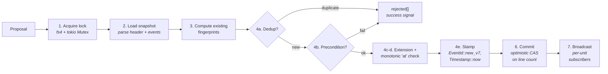
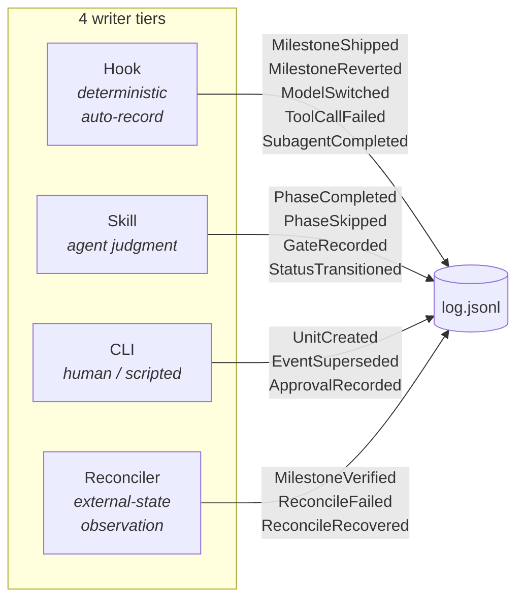
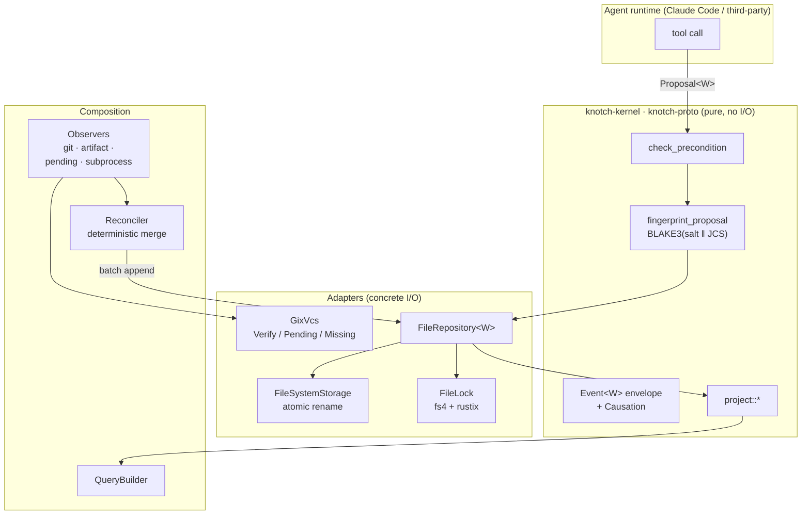
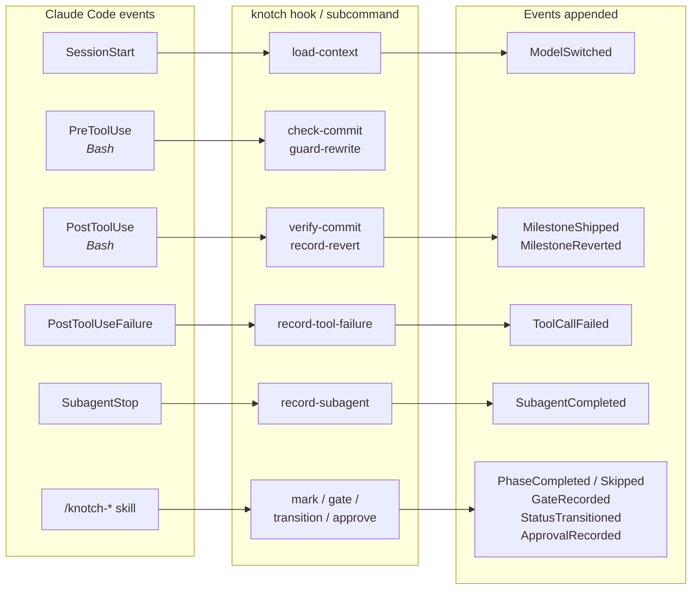

# Knotch

[](https://www.rust-lang.org)
[](https://doc.rust-lang.org/edition-guide/)
[](#quality-gates)
[](#license)

> **English** | **[한국어](README.ko.md)**

> **Git-correlated, event-sourced workflow state — built for AI agents.**

Knotch is a Rust library and `knotch` CLI that gives AI agents a
single, auditable surface for workflow state. Every action an agent
takes lands as an immutable event; every read is a pure projection
over that event log. Nothing else writes the log, and the kernel
performs zero I/O so the invariants hold under replay.

---

## Why knotch

AI agents drive real workflows. A single feature slice typically
produces a flood of state changes: tool calls, git commits, phase
completions, subagent hand-offs, model switches, human approvals.
Naive state stores (`state.json`, a `status.md`, a database row)
absorb these changes by overwriting prior truth. Three failure
modes follow directly — and knotch's design is a direct response
to each.

### 1. Retries either pollute the log or lose the update

Agents retry. At-least-once delivery is a fact of life, not a
design choice. With `state.json` the retried write either
duplicates the row or silently overwrites the first. Knotch
attaches a content-addressed `Fingerprint` — BLAKE3 over the
RFC 8785 JCS canonical form of the dedup tuple
`{workflow, body, supersedes}` — to every proposal. Retries are
silent no-ops that land in `AppendReport::rejected` with reason
`"duplicate"` — the **success signal for at-least-once delivery**,
not an error.

Sources: `crates/knotch-kernel/src/fingerprint.rs::fingerprint_proposal`,
[`.claude/rules/fingerprint.md`](.claude/rules/fingerprint.md).

### 2. Causation collapses at the first rollup

"Who decided this, when, in which session, under which model?" is
a question every audit eventually asks. `state.json` conflates
session, subagent, tool call, and model into whatever fields
happen to be present. Knotch stamps a typed `Causation` on every
event:

```
Causation { source, session, agent_id, trigger }
```

- `source` is `Cli | Hook | Observer` — three unit variants, no
  project-branded growth.
- `trigger` is `Command { name } | GitHook { name } | ToolInvocation
  { tool, call_id } | Observer { name }` — all struct-form so adding
  a field is fingerprint-stable.
- `agent_id` is a top-level `Option<AgentId>` — never synthesized
  from `session`, so "what has this subagent done?" is a
  single-field filter.
- Model identity is deliberately *not* on causation; it lives on
  dedicated `ModelSwitched` events so mid-session `/model`
  switches are faithfully recorded without stale-copy bookkeeping.

Sources: `crates/knotch-kernel/src/causation.rs`,
[`.claude/rules/causation.md`](.claude/rules/causation.md).

### 3. No atomic cross-proposal invariants

"Mark a phase complete, record the gate decision, transition to
`in_review`" is one logical decision. `state.json` files have no
way to coordinate the three. Knotch's `Repository::append` holds
a per-unit lock, runs 15 variant-specific preconditions against a
freshly loaded log, and rolls back the entire batch under
`AppendMode::AllOrNothing` if any proposal is rejected.

Sources: `crates/knotch-storage/src/file_repository.rs::commit_batch`,
[`.claude/rules/append-flow.md`](.claude/rules/append-flow.md),
[`.claude/rules/preconditions.md`](.claude/rules/preconditions.md).

---

## Quick start

```bash
# Scaffold a workspace in your project (install in §Install below)
knotch init --with-hooks

# Create a unit and record a phase
knotch unit init feat-auth
knotch mark completed specify
knotch gate g0-scope pass "scope bounded to OAuth2 password grant"

# Read back
knotch show feat-auth               # projection summary
knotch show feat-auth --format json # same, machine-readable
knotch log feat-auth                # raw event stream
```

All commands support `--json` (machine output) and `--quiet`
globally; every subcommand respects both uniformly.

---

## How it works

### Events, not snapshots

Most workflow tools store the *current state* of a unit in a file
(`state.json`, a database row, a YAML block). Every write
overwrites the previous truth. Three failure modes follow:

| Snapshot model | Event-sourced model (knotch) |
|---|---|
| Two concurrent writers race and lose an update | Optimistic CAS on line count — the second writer retries against the fresh log |
| Status rollback leaves no audit trail | `EventSuperseded` emits an immutable rollback event |
| "Who decided this?" is unrecoverable | Every event carries `Causation` — `source`, `session`, `agent_id`, `trigger` |
| Silent divergence between files (status.md vs status.json) | Markdown frontmatter is a projection of the ledger, synced via `knotch-frontmatter` |

### The append path

Every write through `Repository::append` follows this sequence,
all of it under the unit's lock. The order is enforced by the
adapter and verified in
[`.claude/rules/append-flow.md`](.claude/rules/append-flow.md).



1. **Acquire lock** — `FileLock` (cross-process via `fs4`
   advisory lock + `rustix` stale-lease detection) + per-unit
   `tokio::sync::Mutex` (intra-process).
2. **Load snapshot** — parse the JSONL log header + events.
3. **Compute existing fingerprints** for dedup.
4. **For each proposal** (this order matters):
   - **Dedup** first — if the fingerprint exists, push to
     `rejected` with reason `"duplicate"`.
   - **Precondition** — `EventBody::check_precondition`
     dispatches per variant (see
     [`.claude/rules/preconditions.md`](.claude/rules/preconditions.md)).
   - **Extension precondition** — `ExtensionKind::check_extension`.
   - **Monotonic `at`** — stamped via `stamp_monotonic(&clock,
     last_at)` so every event's `at` is strictly greater than the
     log's last event. Self-heals against clock drift.
   - **Stamp + append to working log** — so the next proposal
     in the batch sees it.
5. **All-or-nothing rollback** — under `AppendMode::AllOrNothing`,
   any rejection discards the entire batch.
6. **Commit** via `Storage::append(unit, expected_len, lines)`.
   Optimistic CAS on `expected_len`; `LogMutated` retries up to
   5× with bounded exponential backoff (25ms base, ≤775ms total).
7. **Broadcast** to per-unit subscribers. No-receivers ignored.

`knotch-linter` rule **R1** (`DirectLogWriteRule`) statically
forbids writes to `log.jsonl` from any crate outside
`knotch-storage`. The rule fails the build, not a review.

### Writers are scoped to four tiers

Fifteen `EventBody` variants split across four tiers; every
variant has exactly one canonical emitter. The table in
[`.claude/rules/event-ownership.md`](.claude/rules/event-ownership.md)
is authoritative — `cargo xtask docs-lint` verifies the split
matches the code.



| Tier | Trigger | Variants owned |
|---|---|---|
| **Hook** | Claude Code hook event | `MilestoneShipped`, `MilestoneReverted`, `ModelSwitched`, `ToolCallFailed`, `SubagentCompleted` |
| **Skill** | agent invokes `/knotch-*` | `PhaseCompleted`, `PhaseSkipped`, `GateRecorded`, `StatusTransitioned` |
| **CLI** | human runs `knotch <cmd>` | `UnitCreated`, `EventSuperseded`, `ApprovalRecorded` |
| **Reconciler** | observer sees external state | `MilestoneVerified`, `ReconcileFailed`, `ReconcileRecovered` |

Nothing else writes. The tier split is mechanically enforced:
hooks and skills route through `knotch-agent` helpers; the CLI
binds those same helpers; `Repository::append` is the one entry
point across all four.

### Reads are projections

All read APIs are pure functions over the log. Eight public
projections live in `crates/knotch-kernel/src/project.rs`:

| Function | Returns |
|---|---|
| `current_phase(&W, &log)` | First required phase not completed/skipped |
| `last_completed_phase(&log)` | Most recent `PhaseCompleted` |
| `current_status(&log)` | Latest `StatusTransitioned` target |
| `shipped_milestones(&log)` | Milestones with a `MilestoneShipped` event |
| `model_timeline(&log)` | Chronological `(timestamp, model)` transitions |
| `subagents(&log)` | Supersede-aware subagent roster |
| `tool_call_timeline(&log, …)` | Per-tool failure history with attempt counter |
| `effective_events(&log)` | Log replay minus superseded events |

The `knotch-query` crate exposes a cross-unit `QueryBuilder<W>`
with AND-composed predicates; `knotch-tracing` emits structured
spans per append. Agents receiving continuous updates subscribe
via
`Repository::subscribe(unit) -> impl Stream<Item = SubscribeEvent<W>>`.

### Architecture

Knotch follows hexagonal ports-and-adapters. `knotch-kernel` is
pure — `knotch-linter` rule **R3** (`KernelNoIoRule`) forbids
`std::fs`, `std::net`, `tokio::fs`, `tokio::net`, and `gix`
imports from the kernel + proto crates. Adapters implement the
ports; composition crates wire them together.



**One generic parameter threads through every API**: `W: WorkflowKind`
(carrying `Phase`, `Milestone`, `Gate`, `Extension` associated
types). Never four separate bounds — RFC 0002 "single bound".

### Workspace layout

```
knotch/
├── crates/
│   ├── knotch-kernel/        # Pure: Event<W>, Repository, preconditions, projections
│   ├── knotch-proto/         # Pure: wire format, JCS, schema versioning
│   ├── knotch-derive/        # Proc-macros for WorkflowKind boilerplate
│   ├── knotch-storage/       # Adapter: JSONL FileSystemStorage + FileRepository
│   ├── knotch-lock/          # Adapter: cross-process FileLock (fs4 + rustix)
│   ├── knotch-vcs/           # Adapter: GixVcs (pure-Rust git, no C deps)
│   ├── knotch-workflow/      # Canonical Knotch workflow + ConfigWorkflow runtime
│   ├── knotch-schema/        # Tier-5: FrontmatterSchema + LifecycleFsm
│   ├── knotch-frontmatter/   # Tier-5: Markdown ↔ ledger status sync
│   ├── knotch-adr/           # Tier-5: ADR lifecycle WorkflowKind
│   ├── knotch-observer/      # Observer trait + git/artifact/pending/subprocess
│   ├── knotch-reconciler/    # Deterministic observer composition
│   ├── knotch-query/         # Cross-unit QueryBuilder (AND-composed predicates)
│   ├── knotch-tracing/       # Stable tracing attribute schema + span helpers
│   ├── knotch-linter/        # cargo knotch-linter (R1/R2/R3 enforcement)
│   ├── knotch-agent/         # Claude Code hook/skill integration library
│   ├── knotch-cli/           # `knotch` reference binary
│   └── knotch-testing/       # Dev-only: InMemoryRepository + simulation harness
├── examples/                 # minimal, pr-workflow, compliance, artifact-probes,
│                             # batch-append, interactive-observer, subprocess-observer-{node,py},
│                             # workflow-{spec-driven,vibe}-case-study
├── plugins/knotch/           # Claude Code plugin bundle (hooks/ + skills/)
├── .claude/rules/            # Path-scoped structural invariants (loaded by Claude Code)
├── .claude/skills/           # Agent skills (knotch-{mark,gate,query,transition,approve})
├── docs/public_api/          # Per-crate public-API baselines (diffed in CI)
├── docs/migrations/          # Adopter migration playbook
└── xtask/                    # cargo xtask {ci,docs-lint,public-api,plugin-sync}
```

Each `crates/<name>/CLAUDE.md` documents that crate's role +
extension recipe. Per-crate structural rules are `@`-imported
from `.claude/rules/` so Claude loads only what's relevant to
the file in play.

---

## Integration value

This is what changes for an AI agent adopter once knotch is wired
in. The pattern throughout: **hooks record the deterministic
events automatically, skills record the agent's judgment
explicitly.**

### Hook-driven auto-recording

Claude Code surfaces five hook event types. The
[`plugins/knotch/hooks/hooks.json`](plugins/knotch/hooks/hooks.json)
bundle routes each to a `knotch hook` subcommand that appends the
appropriate `EventBody` — no agent involvement required.



Concrete coverage, one bullet per hook subcommand:

- **`load-context`** (SessionStart) injects active-unit context
  into the conversation, compares the payload's `model` to
  `project::model_timeline(log).last()`, and appends a
  `ModelSwitched` event when they differ. Covers startup, resume,
  `/clear`, `/compact` — every lifecycle point Claude Code
  re-fires `SessionStart`. **Zero config.**
- **`check-commit`** (PreToolUse, `Bash(git commit *)`) parses
  `-m` / `--message=` / `-F <file>` via `shell-words`, validates
  any `Knotch-Milestone: <id>` trailer before the commit runs.
- **`guard-rewrite`** (PreToolUse, destructive git) warns or
  blocks (per `[guard]` policy) `push --force`, `reset --hard`,
  `branch -D`, `checkout --`, `clean -f`, `rebase -i`.
  `push --force-with-lease` is always exempt.
- **`verify-commit`** (PostToolUse, `Bash(git commit *)`) confirms
  the commit in the VCS and appends
  `MilestoneShipped { status: Pending | Verified }`.
  `PendingCommitObserver` later promotes Pending → Verified when
  the commit reaches the main branch.
- **`record-revert`** (PostToolUse, `Bash(git revert *)`)
  identifies the reverted milestone and appends
  `MilestoneReverted`.
- **`record-tool-failure`** (PostToolUseFailure) caps error
  messages at 1 KiB, filters `is_interrupt == true`
  (user-initiated Esc / Ctrl-C is intent, not failure), emits
  `ToolCallFailed`. The precondition's `(tool, call_id)`
  monotonicity rule catches out-of-order retries.
- **`record-subagent`** (SubagentStop) logs transcript path +
  last message, emits `SubagentCompleted`.
- **`refresh-context`** (UserPromptSubmit) re-injects
  active-unit context; no event emitted.
- **`finalize-session`** (SessionEnd) records residual queue
  size and, for non-resume reasons, clears the per-session
  pointer.

`PostToolUse` hooks fire *after* the tool has succeeded, so they
cannot block. On repository / I/O error they retry 3× (50 ms /
200 ms / 800 ms), then enqueue via `knotch_agent::queue::enqueue_raw`,
then fall back to `~/.knotch/orphan.log` on queue-full.
`SessionStart` auto-drains the queue — transient failures
self-heal on the next session. Full contract:
[`.claude/rules/hook-integration.md`](.claude/rules/hook-integration.md).

### Skill-driven explicit actions

Five skills handle the judgments the agent actually makes:

| Skill | Fires | Agent judgment |
|---|---|---|
| `/knotch-mark` | `PhaseCompleted` / `PhaseSkipped` | "this phase is done / skipped because …" |
| `/knotch-gate` | `GateRecorded { decision, rationale }` | pass / fail / needs-revision at a checkpoint (min 8-char rationale) |
| `/knotch-transition` | `StatusTransitioned { target, forced, rationale }` | shipped / archived / abandoned; forced requires rationale |
| `/knotch-approve` | `ApprovalRecorded` | human co-sign on a prior event |
| `/knotch-query` | *(read-only projection)* | look up current state before planning the next action |

Each skill shells out to a `knotch` subcommand; the hook contract
guarantees identical behavior whether the action came from an
agent tool call, a human `knotch` invocation, or a third-party
harness embedding `knotch-agent`.

### Git milestone correlation end-to-end

**Milestones are opt-in.** Only commits with an explicit
`Knotch-Milestone: <id>` git trailer produce a `MilestoneShipped`
event — no slug-from-description heuristic inflation. The full
flow for `git commit -m "feat: add SSO\n\nKnotch-Milestone: m-sso"`:

1. **`check-commit`** (PreToolUse) extracts the milestone id via
   `extract_milestone_id`, checks it is not already shipped,
   blocks on duplicate.
2. **`verify-commit`** (PostToolUse) confirms the commit in the
   VCS, appends `MilestoneShipped { status: Pending | Verified }`
   (Verified when commit is already on the main branch, Pending
   otherwise).
3. **`PendingCommitObserver`** (reconciler) promotes `Pending` →
   `Verified` when the commit reaches the main branch on the next
   `knotch reconcile` pass.
4. **`record-revert`** (PostToolUse on `git revert`) walks back
   to the original milestone and emits `MilestoneReverted`.

### Observers and reconciliation

Four built-in observers live in `knotch-observer`:

- **`GitLogObserver`** walks `Vcs::log_since`, emits
  `MilestoneShipped` / `MilestoneReverted` from trailers on
  committed revisions.
- **`ArtifactObserver`** scans the filesystem for declared phase
  artifacts, emits `PhaseCompleted` when they appear.
- **`PendingCommitObserver`** promotes
  `MilestoneShipped { status: Pending }` → `MilestoneVerified`
  once the commit reaches the main branch.
- **`SubprocessObserver`** shells out to an external binary; stdin
  is a JSON `ObserverContext`, stdout is `Vec<Proposal<W>>`. Lets
  non-Rust pipelines (deploy, metrics, compliance scanners) feed
  the ledger.

`knotch-reconciler` composes observers deterministically: load
log snapshot → spawn observers on `tokio::task::JoinSet` with
per-observer timeout → collect `Vec<(observer_name, Proposal<W>)>`
→ sort by `(observer_name, kind_ordinal, kind_tag)` → single
`Repository::append` batch call. Observer errors surface in
`ReconcileReport::observer_errors` without aborting the pass.

### Observability join points

`knotch-tracing` emits structured spans per append with a stable
attribute schema. Dashboards pin to these names;
`cargo public-api` catches renames as a stable-surface change.

| Attribute | Value |
|---|---|
| `knotch.unit.id` | `UnitId` string |
| `knotch.event.id` | UUIDv7 of the appended event |
| `knotch.event.kind` | body-variant tag (`milestone_shipped`, `phase_completed`, …) |
| `knotch.source` | `cli` / `hook` / `observer` |
| `knotch.session.id` | conversation / run scope |
| `knotch.agent.id` | subagent UUID (when scoped) |
| `knotch.status.forced` | `true` on forced transitions |
| `knotch.observer.name` | observer's `Observer::name()` (reconciler spans) |
| `knotch.reconcile.accepted` | accepted proposals this pass |
| `knotch.reconcile.rejected` | rejected proposals this pass |
| `knotch.repository.op` | `append` / `load` / `subscribe` / `list_units` / `with_cache` |
| `knotch.repository.outcome` | `accepted` / `rejected` |

External observability (OTel, Prometheus) joins on the same ids —
no separate correlation layer required.

---

## Install

### Quick install (recommended)

**macOS / Linux**
```bash
curl -fsSL https://raw.githubusercontent.com/junyeong-ai/knotch/main/scripts/install.sh | bash
```

**Windows (PowerShell 7+)**
```powershell
iwr -useb https://raw.githubusercontent.com/junyeong-ai/knotch/main/scripts/install.ps1 | iex
```

The installer detects your platform, downloads the prebuilt
binary + Claude Code plugin bundle, verifies SHA256, installs to
`$HOME/.local/bin` (POSIX) or `$USERPROFILE\.local\bin` (Windows),
and optionally installs the plugin at `~/.claude/plugins/knotch`.
It is fully interactive in a terminal and honours `--yes` for CI.

### Supported platforms

| OS | Architecture | Target triple |
|---|---|---|
| Linux | x86_64 | `x86_64-unknown-linux-musl` (static) |
| Linux | arm64 | `aarch64-unknown-linux-musl` (static) |
| macOS | Intel + Apple Silicon | `universal-apple-darwin` (fat binary, ad-hoc codesigned) |
| Windows | x86_64 | `x86_64-pc-windows-msvc` |

### Installer flags

```
--version VERSION              Install a specific version (default: latest)
--install-dir PATH             Binary location (default: $HOME/.local/bin)
--plugin user|project|none     Plugin install level (default: user)
--from-source                  Build from source instead of downloading
--force                        Overwrite existing install without prompting
--yes, -y                      Non-interactive mode (accepts all defaults)
--dry-run                      Print plan, do not execute
```

Every flag has a matching `KNOTCH_*` environment variable
(`KNOTCH_VERSION`, `KNOTCH_INSTALL_DIR`, `KNOTCH_PLUGIN_LEVEL`,
`KNOTCH_FROM_SOURCE`, `KNOTCH_FORCE`, `KNOTCH_YES`, `KNOTCH_DRY_RUN`).
Set `NO_COLOR=1` to disable ANSI colour. Flags take precedence over
environment; environment takes precedence over defaults.

### cargo-binstall

```bash
cargo binstall knotch-cli
```

Downloads the same prebuilt archive the install script uses,
driven by `[package.metadata.binstall]` in
`crates/knotch-cli/Cargo.toml`.

<details>
<summary><b>Manual install with checksum verification</b></summary>

```bash
# Resolve the latest release tag (or pin to a specific v*.*.* tag yourself).
VERSION=$(curl -fsSL https://api.github.com/repos/junyeong-ai/knotch/releases/latest \
  | grep -oE '"tag_name": *"v[^"]+"' | head -n1 | cut -d'"' -f4 | sed 's/^v//')
TARGET=x86_64-unknown-linux-musl
BASE="https://github.com/junyeong-ai/knotch/releases/download/v$VERSION"
curl -fLO "$BASE/knotch-v$VERSION-$TARGET.tar.gz"
curl -fLO "$BASE/knotch-v$VERSION-$TARGET.tar.gz.sha256"
shasum -a 256 -c "knotch-v$VERSION-$TARGET.tar.gz.sha256"
tar -xzf "knotch-v$VERSION-$TARGET.tar.gz"
install -m 755 knotch "$HOME/.local/bin/knotch"
```

Every release artifact is additionally signed with SLSA build
provenance (`actions/attest-build-provenance`) — verify with
`gh attestation verify <archive>.tar.gz --owner junyeong-ai`.

</details>

<details>
<summary><b>Build from source</b></summary>

```bash
git clone https://github.com/junyeong-ai/knotch
cd knotch
./scripts/install.sh --from-source
# or: cargo install --path crates/knotch-cli --locked
```

</details>

### Uninstall

```bash
# macOS / Linux
curl -fsSL https://raw.githubusercontent.com/junyeong-ai/knotch/main/scripts/uninstall.sh | bash

# Windows
iwr -useb https://raw.githubusercontent.com/junyeong-ai/knotch/main/scripts/uninstall.ps1 | iex
```

---

## CLI

```bash
# Workspace lifecycle
knotch init [--with-hooks] [--demo]      # scaffold knotch.toml + state/ + .knotch/
knotch doctor                            # health check (rule files, env vars, observers)
knotch migrate                           # schema-version detection
knotch completions <bash|zsh|fish|…>     # shell completions

# Unit management
knotch unit init <id>                    # create a unit dir
knotch unit use <id>                     # set active (.knotch/active.toml)
knotch unit list                         # enumerate known units
knotch unit current                      # print active unit slug
knotch current                           # alias of `unit current`

# Read / replay
knotch show <unit> [--format summary|brief|raw|json]
knotch log <unit>                        # raw JSONL event stream
knotch reconcile [--prune] [--prune-older <HOURS>] [--queue-only] [--unit <id>]

# Write (human-driven, rare)
knotch supersede <event-id> <rationale>
knotch approve <unit> <event-id>

# Write (skill-driven — /knotch-* skills shell out to these)
knotch mark <completed|skipped> <phase> [--artifact <path>]... [--reason <text>]
knotch gate <gate-id> <decision> <rationale>
knotch transition <target> [--forced --reason <text>]

# Claude Code hook dispatch (JSON on stdin)
knotch hook <load-context|check-commit|verify-commit|record-revert|
             guard-rewrite|record-subagent|record-tool-failure|
             refresh-context|finalize-session>
```

`--json` and `--quiet` are **global** flags; every subcommand respects them.

---

## Configuration

### `knotch.toml`

```toml
# Directory (relative to knotch.toml) where per-unit logs live.
state_dir = "state"
schema_version = 1

# Guard-rewrite policy. Controls how the `guard-rewrite` hook
# treats history-rewriting git commands.
[guard]
rewrite = "warn"   # warn | block | off

# The lifecycle this project runs. Defaults to the canonical
# Knotch workflow; edit freely to tailor to your domain.
[workflow]
name = "knotch"
schema_version = 1
terminal_statuses = ["archived", "abandoned", "superseded", "deprecated"]
known_statuses = [
    "draft", "in_progress", "in_review", "shipped",
    "archived", "abandoned", "superseded", "deprecated",
]

[workflow.required_phases]
tiny = ["specify", "build", "ship"]
standard = ["specify", "plan", "build", "review", "ship"]

[[workflow.phases]]
id = "specify"
# ... plan / build / review / ship

# Optional subprocess observers — knotch shells out to each binary
# during `knotch reconcile`. Stdin is a JSON ObserverContext;
# stdout is a JSON Vec<Proposal<W>>.
[[observers]]
name = "artifact-scan"
binary = "./tools/artifact-scan.py"
```

### Environment variables

| Variable | Consumer | Fallback |
|---|---|---|
| `KNOTCH_ROOT` | Global `--root` override | walks up from cwd to `knotch.toml` |
| `KNOTCH_UNIT` | Active-unit resolution (top priority in the hook chain) | `.knotch/sessions/<id>.toml` → `.knotch/active.toml` |

Model attribution is zero-config: Claude Code stamps the active
model on every `SessionStart` payload, and the `load-context`
hook appends a `ModelSwitched` event whenever the payload value
differs from the last one recorded. No shell / `.envrc` setup
required — just make sure `knotch init --with-hooks` wired the
`SessionStart` hook into your Claude Code settings.

### Guard policy

`knotch.toml` → `[guard]` section controls how the `guard-rewrite`
hook treats history-rewriting git commands (`push --force`,
`reset --hard`, `branch -D`, `checkout --`, `clean -f`,
`rebase -i/--root`):

| Policy | Behaviour |
|---|---|
| `warn` (default) | Claude receives a warning in context; command still runs |
| `block` | Hook exits 2; command cancelled |
| `off` | Silent no-op — for solo experimentation / throwaway branches |

`git push --force-with-lease` is always exempt — it is Git's safe
atomic-CAS push.

---

## Scope contract

Knotch ships only ledger-structural primitives. The scope contract
in [`.claude/rules/governance.md`](.claude/rules/governance.md)
enforces this via a four-question PR rubric:

1. **Structural invariant.** Does this enforce an invariant of
   append-only workflow ledgers?
2. **Universality.** Name two hypothetical adopters beyond the
   requester that would need this.
3. **Opt-in shape.** Can this ship as an optional crate rather
   than kernel surface?
4. **Public-API impact.** Does this change
   `docs/public_api/*.baseline`?

Features that walk the line ship as optional Tier-5 crates
(`knotch-frontmatter`, `knotch-adr` are precedent), never in the
kernel.

### What knotch is not

- **Not a task tracker.** Units are slug-indexed ledgers, not a
  ticket system. Milestones are explicitly named via commit
  trailers — knotch refuses to invent them from free-form messages.
- **Not a secret scanner.** Commit messages land in the log
  verbatim. Run gitleaks / trufflehog / detect-secrets upstream
  of `knotch hook check-commit`; `knotch doctor` warns when no
  scanner is configured.
- **Not a document store.** Artifact paths are references. The
  artifacts themselves stay in your repository.
- **Not a workflow engine.** Dashboards, template catalogs,
  business policy, and project-branded rules are explicitly
  vetoed. Knotch ships only ledger-structural primitives.

---

## Quality gates

Every push runs the following; failure blocks merge.

| Gate | Command | Purpose |
|---|---|---|
| Format | `cargo +nightly fmt --all --check` | Nightly rustfmt applies the unstable keys in `rustfmt.toml` (import grouping, comment wrap) |
| Lint | `cargo clippy --workspace --all-targets --all-features -- -D warnings` | `-D warnings` on stable + beta toolchains |
| Tests | `cargo nextest run --workspace --all-features` + `cargo test --workspace --all-features --doc` | ubuntu / macos / windows × stable / beta, plus a dedicated `ubuntu / 1.94 MSRV` row that doubles as the MSRV gate |
| Coverage | `cargo llvm-cov` | Uploaded to Codecov |
| Structural lint | `cargo knotch-linter` | R1 (DirectLogWriteRule), R2 (ForbiddenNameRule), R3 (KernelNoIoRule) |
| Unused deps | `cargo machete` | Workspace-wide |
| Security | `cargo deny check` | License allowlist + CVE advisories |
| Semver | `cargo semver-checks` | Classifies patch / minor / major; fails on version-bump mismatch |
| Public API | `cargo public-api --diff-against docs/public_api/<crate>.baseline` | Any surface change requires refreshed baseline in the same commit |
| Docs citations | `cargo xtask docs-lint` | Every `crate/path.rs:LINE` citation in `.claude/rules/` must still resolve |
| Fuzzing | `cargo fuzz` (nightly workflow) | Scheduled daily |
| Install | `install-test.yml` | 3-OS × (from-source + prebuilt) sandboxed round-trip |

`#![forbid(unsafe_code)]` is declared workspace-wide in
`Cargo.toml [workspace.lints.rust]`. No exceptions — the 2026
safe-wrapper stack (`rustix`, `fs4`, `gix`) covers every low-level
concern.

---

## Agent integration

If you are an AI agent reading this repository, start with
[`CLAUDE.md`](CLAUDE.md) — the progressive-disclosure entry point
to `.claude/rules/` and `.claude/skills/`. Every claim is backed by
a `crate/path.rs:LINE` citation that `cargo xtask docs-lint`
verifies every commit.

- [`.claude/skills/knotch-query/SKILL.md`](.claude/skills/knotch-query/SKILL.md) — read projections
- [`.claude/skills/knotch-mark/SKILL.md`](.claude/skills/knotch-mark/SKILL.md) — record phase completions / skips
- [`.claude/skills/knotch-gate/SKILL.md`](.claude/skills/knotch-gate/SKILL.md) — record gate decisions
- [`.claude/skills/knotch-transition/SKILL.md`](.claude/skills/knotch-transition/SKILL.md) — transition unit status
- [`.claude/skills/knotch-approve/SKILL.md`](.claude/skills/knotch-approve/SKILL.md) — human co-sign on prior events
- [`.claude/rules/hook-integration.md`](.claude/rules/hook-integration.md) — hook exit-code contract
- [`.claude/rules/event-ownership.md`](.claude/rules/event-ownership.md) — per-variant owner table

Third-party harnesses embed `knotch-agent` from their own binary
rather than wrapping `knotch-cli`. The hook contract is identical —
different binary, same library.

Adopters migrating from their own state layer follow the phased
pattern in [`docs/migrations/README.md`](docs/migrations/README.md).
Adopter-specific plans stay in the adopter's own repository —
knotch ships the universal playbook, not project-branded
migration docs.

---

## License

Dual-licensed under either

- [Apache License, Version 2.0](./LICENSE-APACHE), or
- [MIT license](./LICENSE-MIT)

at your option.

---

> **English** | **[한국어](README.ko.md)**
