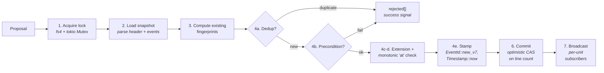
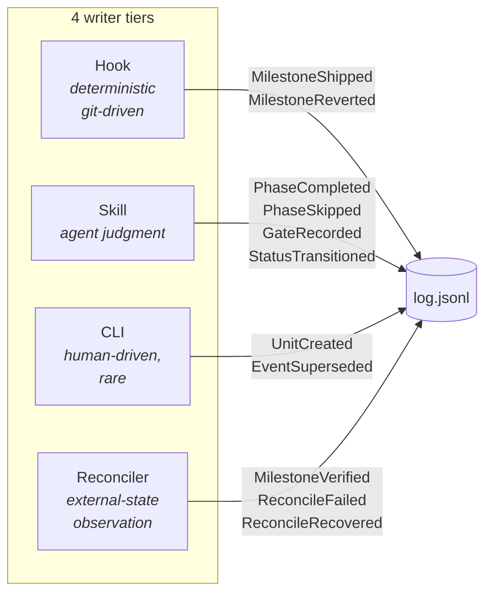

# Knotch

[](https://www.rust-lang.org)
[](https://doc.rust-lang.org/edition-guide/)
[](#quality-gates)
[](#license)

> **English** | **[한국어](README.ko.md)**

> **Git-correlated, event-sourced workflow state — built for AI agents.**

Knotch is a Rust library and `knotch` CLI that gives AI agents a
single, auditable surface for workflow state. Every action an agent
takes lands as an immutable event; every read is a pure projection
over that event log. Nothing else writes the log, and the kernel
performs zero I/O so the invariants hold under replay.

---

## Quick start

```bash
# 1. Install the binary + Claude Code plugin (macOS / Linux)
curl -fsSL https://raw.githubusercontent.com/knotch-rs/knotch/main/scripts/install.sh | bash

# 2. Scaffold a workspace in your project
knotch init --with-hooks

# 3. Create a unit and mark a phase complete
knotch unit init feat-auth
knotch mark completed specify
knotch gate g0-scope pass "scope bounded to OAuth2 password grant"

# 4. Read back
knotch show feat-auth               # projection summary
knotch show feat-auth --format json # same, machine-readable
knotch log feat-auth                # raw event stream
```

All commands support `--json` (machine output) and `--quiet` globally;
every subcommand respects both uniformly.

---

## What knotch does

- **Ledger, not state file.** Each unit's history is an append-only
  JSONL log. Status / phase / milestone are **projected** from that
  log — there is no `state.json` that can drift.
- **Idempotent by construction.** Every proposal is
  content-addressed (BLAKE3 over the RFC 8785 JCS canonical form).
  Retrying a proposal produces `rejected: [{ reason: "duplicate" }]`
  — the **success signal for at-least-once delivery**, not an error.
- **Agent-first observability.** Every event carries a `Causation`
  chain (agent id, model, harness, session id, trace id, tool-call
  id, cost). `knotch-tracing` emits those as structured spans so
  external observability (OTel, Prometheus) joins on the same ids.
- **Git-correlated.** Milestones attach to commits through a
  `Knotch-Milestone: <id>` git trailer; reverts surface through
  `knotch hook record-revert`; the reconciler promotes pending
  commits to verified when they reach the main branch.

## What knotch is not

- **Not a task tracker.** Units are slug-indexed ledgers, not a
  ticket system. Milestones are explicitly named via commit
  trailers — knotch refuses to invent them from free-form messages.
- **Not a secret scanner.** Commit messages land in the log
  verbatim. Run gitleaks / trufflehog / detect-secrets upstream
  of `knotch hook check-commit`; `knotch doctor` warns when no
  scanner is configured.
- **Not a document store.** Artifact paths are references. The
  artifacts themselves stay in your repository.
- **Not a workflow engine.** Scope contract in
  [`.claude/rules/governance.md`](.claude/rules/governance.md)
  vetoes dashboards, template catalogs, business policy, and
  project-branded rules. Knotch ships only ledger-structural
  primitives.

---

## How it works

### Events, not snapshots

Most workflow tools store the *current state* of a unit in a file
(`state.json`, a database row, a YAML block). Every write overwrites
the previous truth. Three failure modes follow:

| Snapshot model | Event-sourced model (knotch) |
|---|---|
| Two concurrent writers race and lose an update | Optimistic CAS on line count — the second writer retries against the fresh log |
| Status rollback leaves no audit trail | `EventSuperseded` emits an immutable rollback event |
| "Who decided this?" is unrecoverable | Every event carries `Causation` — principal, session, trigger, cost |
| Silent divergence between files (status.md vs status.json) | Markdown frontmatter is a projection of the ledger, synced via `knotch-frontmatter` |

### The append path

Every write through `Repository::append` follows this sequence,
all of it under the unit's lock. The order is enforced by the
adapter and verified in
[`.claude/rules/append-flow.md`](.claude/rules/append-flow.md).



1. **Acquire lock** — `FileLock` (cross-process via `fs4`
   advisory lock + `rustix` stale-lease detection) + per-unit
   `tokio::sync::Mutex` (intra-process).
2. **Load snapshot** — parse the JSONL log header + events.
3. **Compute existing fingerprints** for dedup.
4. **For each proposal** (this order matters):
   - **Dedup** first — if the fingerprint exists, push to
     `rejected` with reason `"duplicate"`.
   - **Precondition** — `EventBody::check_precondition`
     dispatches per variant (see
     [`.claude/rules/preconditions.md`](.claude/rules/preconditions.md)).
   - **Extension precondition** — `ExtensionKind::check_extension`.
   - **Monotonic `at`** — stamped via `stamp_monotonic(&clock,
     last_at)` so every event's `at` is strictly greater than the
     log's last event. Self-heals against clock drift.
   - **Stamp + append to working log** — so the next proposal
     in the batch sees it.
5. **All-or-nothing rollback** — under `AppendMode::AllOrNothing`,
   any rejection discards the entire batch.
6. **Commit** via `Storage::append(unit, expected_len, lines)`.
   Optimistic CAS on `expected_len` — a concurrent writer that
   extended the log returns `LogMutated`; the caller retries.
7. **Broadcast** to per-unit subscribers. No-receivers ignored.

`knotch-linter` rule **R1** (`DirectLogWriteRule`) statically
forbids writes to `log.jsonl` from any crate outside
`knotch-storage`. The rule fails the build, not a review.

### Writers are scoped to four tiers

Every `EventBody` variant has one canonical emitter. The table
in [`.claude/rules/event-ownership.md`](.claude/rules/event-ownership.md)
is authoritative.



| Tier | Trigger | Example |
|---|---|---|
| **Hook** | git command completes | `git commit` with `Knotch-Milestone:` trailer → `MilestoneShipped` |
| **Skill** | agent invokes `/knotch-*` | `/knotch-mark completed implement` → `PhaseCompleted` |
| **CLI** | human runs `knotch <cmd>` | `knotch supersede <event-id> "..."` → `EventSuperseded` |
| **Reconciler** | observer sees external state | `PendingCommitObserver` promotes `Pending` → `Verified` |

Nothing else writes. The tier split is mechanically enforced:
hooks and skills route through `knotch-agent` helpers; the CLI
binds those same helpers; `Repository::append` is the one entry
point across all four.

### Reads are projections

All read APIs are pure functions over the log:

- `knotch_kernel::project::current_phase(&W, &log) -> Option<W::Phase>`
- `knotch_kernel::project::current_status(&log) -> Option<StatusId>`
- `knotch_kernel::project::shipped_milestones(&log) -> BTreeSet<W::Milestone>`
- `knotch_kernel::project::total_cost(&log) -> Cost`

The `knotch-query` crate exposes a cross-unit `QueryBuilder<W>`;
`knotch-tracing` emits structured spans per append. Agents
receiving continuous updates subscribe via
`Repository::subscribe(unit) -> impl Stream<Item = SubscribeEvent<W>>`.

### Architecture

Knotch follows hexagonal ports-and-adapters. `knotch-kernel` is
pure — `knotch-linter` rule **R3** (`KernelNoIoRule`) forbids
`std::fs`, `std::net`, `tokio::fs`, `tokio::net`, and `gix`
imports from the kernel + proto crates. Adapters implement the
ports; composition crates wire them together.


**One generic parameter threads through every API**: `W: WorkflowKind`
(carrying `Phase`, `Milestone`, `Gate`, `Extension` associated
types). Never four separate bounds — RFC 0002 "single bound".

### Workspace layout

```
knotch/
├── crates/
│   ├── knotch-kernel/        # Pure: Event<W>, Repository, preconditions, projections
│   ├── knotch-proto/         # Pure: wire format, JCS, schema versioning
│   ├── knotch-derive/        # Proc-macros for WorkflowKind boilerplate
│   ├── knotch-storage/       # Adapter: JSONL FileSystemStorage + FileRepository
│   ├── knotch-lock/          # Adapter: cross-process FileLock (fs4 + rustix)
│   ├── knotch-vcs/           # Adapter: GixVcs (pure-Rust git, no C deps)
│   ├── knotch-workflow/      # Canonical Knotch workflow + ConfigWorkflow runtime
│   ├── knotch-schema/        # Tier-5: FrontmatterSchema + LifecycleFsm
│   ├── knotch-frontmatter/   # Tier-5: Markdown ↔ ledger status sync
│   ├── knotch-adr/           # Tier-5: ADR lifecycle WorkflowKind
│   ├── knotch-observer/      # Observer trait + git/artifact/pending/subprocess
│   ├── knotch-reconciler/    # Deterministic observer composition
│   ├── knotch-query/         # Cross-unit QueryBuilder + LLM summary
│   ├── knotch-tracing/       # Attribute schema + span helpers
│   ├── knotch-linter/        # cargo knotch-linter (R1/R2/R3 enforcement)
│   ├── knotch-agent/         # Claude Code hook/skill integration library
│   ├── knotch-cli/           # `knotch` reference binary
│   └── knotch-testing/       # Dev-only: InMemoryRepository + simulation harness
├── examples/                 # Minimal, pr-workflow, compliance, 2 case-studies, …
├── plugins/knotch/           # Claude Code plugin bundle (hooks/ + skills/)
├── .claude/rules/            # Structural invariants (10 path-scoped rule files)
├── .claude/skills/           # Agent skills (knotch-{mark,gate,query,transition})
├── docs/public_api/          # Public-API baselines (17 library crates)
├── docs/migrations/          # Adopter migration playbook
└── xtask/                    # cargo xtask {ci,docs-lint,public-api,plugin-sync}
```

Each `crates/<name>/CLAUDE.md` documents that crate's role + extension
recipe. Per-crate structural rules are `@`-imported from
`.claude/rules/` so Claude loads only what's relevant to the
file in play.

---

## CLI

```bash
# Workspace lifecycle
knotch init [--with-hooks] [--demo]      # scaffold knotch.toml + state/ + .knotch/
knotch doctor                            # health check (rule files, env vars, observers)
knotch migrate                           # schema-version detection
knotch completions <bash|zsh|fish|…>     # shell completions

# Unit management
knotch unit init <id>                    # create a unit dir
knotch unit use <id>                     # set active (.knotch/active.toml)
knotch unit list                         # enumerate known units
knotch unit current                      # print active unit slug
knotch current                           # alias of `unit current`

# Read / replay
knotch show <unit> [--format summary|brief|raw|json]
knotch log <unit>                        # raw JSONL event stream
knotch reconcile [--prune] [--prune-older <HOURS>] [--queue-only] [--unit <id>]

# Write (human-driven, rare)
knotch supersede <event-id> <rationale>

# Write (skill-driven — /knotch-* skills shell out to these)
knotch mark <completed|skipped> <phase> [--artifact <path>]... [--reason <text>]
knotch gate <gate-id> <decision> <rationale>
knotch transition <target> [--forced --reason <text>]

# Claude Code hook dispatch (JSON on stdin)
knotch hook <load-context|check-commit|verify-commit|record-revert|
             guard-rewrite|record-subagent|refresh-context|finalize-session>
```

`--json` and `--quiet` are **global** flags; every subcommand respects them.

---

## Install

### Quick install (recommended)

**macOS / Linux**
```bash
curl -fsSL https://raw.githubusercontent.com/knotch-rs/knotch/main/scripts/install.sh | bash
```

**Windows (PowerShell 7+)**
```powershell
iwr -useb https://raw.githubusercontent.com/knotch-rs/knotch/main/scripts/install.ps1 | iex
```

The installer detects your platform, downloads the prebuilt binary
+ Claude Code plugin bundle, verifies SHA256, installs to
`$HOME/.local/bin` (POSIX) or `$USERPROFILE\.local\bin` (Windows),
and optionally installs the plugin at `~/.claude/plugins/knotch`.
It is fully interactive in a terminal and honours `--yes` for CI.

### Supported platforms

| OS | Architecture | Target triple |
|---|---|---|
| Linux | x86_64 | `x86_64-unknown-linux-musl` (static) |
| Linux | arm64 | `aarch64-unknown-linux-musl` (static) |
| macOS | Intel + Apple Silicon | `universal-apple-darwin` (fat binary, ad-hoc codesigned) |
| Windows | x86_64 | `x86_64-pc-windows-msvc` |

### Installer flags

```
--version VERSION              Install a specific version (default: latest)
--install-dir PATH             Binary location (default: $HOME/.local/bin)
--plugin user|project|none     Plugin install level (default: user)
--from-source                  Build from source instead of downloading
--force                        Overwrite existing install without prompting
--yes, -y                      Non-interactive mode (accepts all defaults)
--dry-run                      Print plan, do not execute
```

Every flag has a matching `KNOTCH_*` environment variable
(`KNOTCH_VERSION`, `KNOTCH_INSTALL_DIR`, `KNOTCH_PLUGIN_LEVEL`,
`KNOTCH_FROM_SOURCE`, `KNOTCH_FORCE`, `KNOTCH_YES`, `KNOTCH_DRY_RUN`).
Set `NO_COLOR=1` to disable ANSI colour. Flags take precedence over
environment; environment takes precedence over defaults.

### cargo-binstall

```bash
cargo binstall knotch-cli
```

Downloads the same prebuilt archive the install script uses, driven
by `[package.metadata.binstall]` in `crates/knotch-cli/Cargo.toml`.

### Manual install with checksum verification

```bash
VERSION=0.1.0
TARGET=x86_64-unknown-linux-musl
BASE="https://github.com/knotch-rs/knotch/releases/download/v$VERSION"
curl -fLO "$BASE/knotch-v$VERSION-$TARGET.tar.gz"
curl -fLO "$BASE/knotch-v$VERSION-$TARGET.tar.gz.sha256"
shasum -a 256 -c "knotch-v$VERSION-$TARGET.tar.gz.sha256"
tar -xzf "knotch-v$VERSION-$TARGET.tar.gz"
install -m 755 knotch "$HOME/.local/bin/knotch"
```

Every release artifact is additionally signed with SLSA build
provenance (`actions/attest-build-provenance`) — verify with
`gh attestation verify <archive>.tar.gz --owner knotch-rs`.

### Build from source

```bash
git clone https://github.com/knotch-rs/knotch
cd knotch
./scripts/install.sh --from-source
# or: cargo install --path crates/knotch-cli --locked
```

### Uninstall

```bash
# macOS / Linux
curl -fsSL https://raw.githubusercontent.com/knotch-rs/knotch/main/scripts/uninstall.sh | bash

# Windows
iwr -useb https://raw.githubusercontent.com/knotch-rs/knotch/main/scripts/uninstall.ps1 | iex
```

---

## Quality gates

Every push runs the following; failure blocks merge.

| Gate | Command | Purpose |
|---|---|---|
| Format | `cargo +nightly fmt --all --check` | Nightly rustfmt applies the unstable keys in `rustfmt.toml` (import grouping, comment wrap) |
| Lint | `cargo clippy --workspace --all-targets --all-features -- -D warnings` | `-D warnings` stable + beta toolchains |
| Tests | `cargo nextest run --workspace --all-features` + `cargo test --workspace --all-features --doc` | ubuntu / macos / windows × stable / beta, plus a dedicated `ubuntu / 1.94 MSRV` row that doubles as the MSRV gate |
| Coverage | `cargo llvm-cov` | Uploaded to Codecov |
| Structural lint | `cargo knotch-linter` | R1 (DirectLogWriteRule), R2 (FingerprintAlgorithmRule), R3 (KernelNoIoRule) |
| Unused deps | `cargo machete` | Workspace-wide |
| Security | `cargo deny check` | License allowlist + CVE advisories |
| Semver | `cargo semver-checks` | Classifies patch / minor / major; fails on version-bump mismatch |
| Public API | `cargo public-api --diff-against docs/public_api/<crate>.baseline` | Any surface change requires refreshed baseline in the same commit |
| Docs citations | `cargo xtask docs-lint` | Every `crate/path.rs:LINE` citation in `.claude/rules/` must still resolve |
| Fuzzing | `cargo fuzz` (nightly workflow, 3600s per target) | Scheduled daily |
| Install | `install-test.yml` | 3-OS × (from-source + prebuilt) sandboxed round-trip |

`#![forbid(unsafe_code)]` is declared workspace-wide in
`Cargo.toml [workspace.lints.rust]`. No exceptions — the 2026
safe-wrapper stack (`rustix`, `fs4`, `gix`) covers every low-level
concern.

---

## Configuration

### `knotch.toml`

```toml
# Directory (relative to knotch.toml) where per-unit logs live.
state_dir = "state"
schema_version = 1

# Guard-rewrite policy. Controls how the `guard-rewrite` hook
# treats history-rewriting git commands.
[guard]
rewrite = "warn"   # warn | block | off

# The lifecycle this project runs. Defaults to the canonical
# Knotch workflow; edit freely to tailor to your domain.
[workflow]
name = "knotch"
schema_version = 1
terminal_statuses = ["archived", "abandoned", "superseded", "deprecated"]
known_statuses = [
    "draft", "in_progress", "in_review", "shipped",
    "archived", "abandoned", "superseded", "deprecated",
]

[workflow.required_phases]
tiny = ["specify", "build", "ship"]
standard = ["specify", "plan", "build", "review", "ship"]

[[workflow.phases]]
id = "specify"
# ... plan / build / review / ship

# Optional subprocess observers — knotch shells out to each binary
# during `knotch reconcile`. Stdin is a JSON ObserverContext;
# stdout is a JSON Vec<Proposal<W>>.
[[observers]]
name = "artifact-scan"
binary = "./tools/artifact-scan.py"
```

### Environment variables

| Variable | Consumer | Fallback |
|---|---|---|
| `KNOTCH_ROOT` | Global `--root` override | walks up from cwd to `knotch.toml` |
| `KNOTCH_UNIT` | Active-unit resolution (top priority in the hook chain) | `.knotch/sessions/<id>.toml` → `.knotch/active.toml` |
| `KNOTCH_MODEL` | `hook_causation.principal.model` | `"unknown"` |
| `KNOTCH_HARNESS` | `hook_causation.principal.harness` | `"claude-code"` |

Export `KNOTCH_MODEL` + `KNOTCH_HARNESS` in your shell profile
(or `.envrc`) so every hook-emitted event records accurate
attribution. Without them, downstream "which model did what"
queries collapse to `"unknown"`. `knotch doctor` warns when
either is unset.

### Guard policy

`knotch.toml` → `[guard]` section controls how the `guard-rewrite`
hook treats history-rewriting git commands (`push --force`,
`reset --hard`, `branch -D`, `checkout --`, `clean -f`,
`rebase -i/--root`):

| Policy | Behaviour |
|---|---|
| `warn` (default) | Claude receives a warning in context; command still runs |
| `block` | Hook exits 2; command cancelled |
| `off` | Silent no-op — for solo experimentation / throwaway branches |

`git push --force-with-lease` is always exempt — it is Git's safe
atomic-CAS push.

---

## Agent integration

If you are an AI agent reading this repository, start with
[`CLAUDE.md`](CLAUDE.md) — the progressive-disclosure entry point
to `.claude/rules/` and `.claude/skills/`. Every claim is backed by
a `crate/path.rs:LINE` citation that `cargo xtask docs-lint`
verifies every commit.

- [`.claude/skills/knotch-query/SKILL.md`](.claude/skills/knotch-query/SKILL.md) — read projections
- [`.claude/skills/knotch-mark/SKILL.md`](.claude/skills/knotch-mark/SKILL.md) — record phase completions / skips
- [`.claude/skills/knotch-gate/SKILL.md`](.claude/skills/knotch-gate/SKILL.md) — record gate decisions
- [`.claude/skills/knotch-transition/SKILL.md`](.claude/skills/knotch-transition/SKILL.md) — transition unit status
- [`.claude/rules/hook-integration.md`](.claude/rules/hook-integration.md) — hook exit-code contract
- [`.claude/rules/event-ownership.md`](.claude/rules/event-ownership.md) — per-variant owner table

Third-party harnesses embed `knotch-agent` from their own binary
rather than wrapping `knotch-cli`. The hook contract is identical —
different binary, same library.

Adopters migrating from their own state layer follow the phased
pattern in [`docs/migrations/README.md`](docs/migrations/README.md).
Existing plans live in their respective repos: Grove
(`grove/docs/migration/knotch-migration-plan.md`, phases `M1..M6`)
and webloom (`webloom/docs/integrations/knotch/README.md`,
phases `W1..W5`).

---

## License

Dual-licensed under either

- [Apache License, Version 2.0](./LICENSE-APACHE), or
- [MIT license](./LICENSE-MIT)

at your option.

---

> **English** | **[한국어](README.ko.md)**
