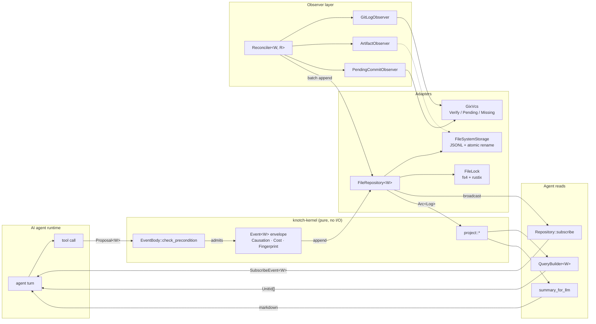

# Knotch

[](https://doc.rust-lang.org/edition-guide/)
[](#license)

> **Git-correlated, event-sourced workflow state for AI agents.**

Knotch is a Rust library — and a `knotch` CLI — that gives AI agents
a single, auditable surface for workflow state: every action is an
event, the event log is the sole truth, and every read is a pure
projection over that log.

**Not** a general-purpose task tracker. **Not** a document store. The
library does one thing: **mediate between an agent's tool-calls and
a durable, replayable, git-correlated workflow history.**

---

## Design in one picture



Every arrow from agent to store passes through:
**Proposal → Precondition → Fingerprint dedup → Monotonic timestamp → Commit → Broadcast**.

There is no other write path. `knotch-linter` rule **R1** statically
forbids code outside `knotch-storage` from writing `log.jsonl`.

---

## Append-time contract

Duplicate proposals (same `Fingerprint`) silently become
`rejected: [{ reason: "duplicate" }]` — the **success signal for
idempotent retries**, not an error. The full step sequence
(lock → load → dedup → precondition → monotonic stamp → commit →
broadcast) is specified in
[`.claude/rules/append-flow.md`](.claude/rules/append-flow.md).

## Event shape

Every `Event<W>` carries a `Causation { source, principal, session,
trace, trigger, parent_event, cost }`. `Person` and `AgentId` are
`Sensitive` — the `knotch-tracing` subscriber writes BLAKE3-16
hashes instead of raw values. Full variant + field list:
[`.claude/rules/causation.md`](.claude/rules/causation.md).

## Workspace layout

`knotch-kernel` is I/O-free (`knotch-linter` rule **R3**). Every
adapter depends on the kernel; the kernel depends on no adapter.
Per-crate role + extension recipes live in each crate's
`CLAUDE.md`:

- **Pure** (no I/O): `knotch-kernel`, `knotch-proto`, `knotch-derive`
- **Ports + adapters**: `knotch-storage`, `knotch-lock`, `knotch-vcs`
- **Composition**: `knotch-observer`, `knotch-reconciler`,
  `knotch-query`, `knotch-tracing`, `knotch-schema`
- **Canonical workflow**: `knotch-workflow` (the `Knotch`
  `WorkflowKind` + runtime dynamic types)
- **Harness**: `knotch-agent` (hook/skill library), `knotch-cli`
  (reference binary), `knotch-linter` (`cargo knotch-linter`)
- **Dev-only**: `knotch-testing` (`InMemoryRepository<W>`,
  `InMemoryVcs`, simulation harness)

Adopter-specific workflow forks live in `examples/workflow-*-case-study/`
(spec-driven and vibe case studies). Roll your own in your repo
when your shape differs from `Knotch`.

## Constitution

Principles — event log is the only truth, single writer per
unit, idempotence by construction, purity boundary, hexagonal
ports + adapters, clean from zero, automated compliance,
agent-first observability, determinism. Authoritative text:
[`.claude/rules/constitution.md`](.claude/rules/constitution.md).

---

## CLI

```bash
# Workspace lifecycle
knotch init [--with-hooks]
                             # scaffold knotch.toml + state/ + .knotch/
                             # bound to the canonical `Knotch` workflow;
                             # with --with-hooks merges the hook block
                             # into Claude Code settings
knotch doctor                # workspace health check
knotch migrate               # schema-version detection
knotch completions <shell>   # shell completions

# Unit management
knotch unit init <id>        # create a unit directory
knotch unit use <id>         # set active unit (.knotch/active.toml)
knotch unit list             # list known units
knotch unit current          # print active unit slug
knotch current               # alias of `unit current`

# Read / replay
knotch show <unit> [--format summary|brief|raw|json]
                             # projection (brief replaces the old
                             # `knotch status`)
knotch log <unit>            # raw JSONL event stream
knotch reconcile [--prune] [--prune-older <HOURS>]
                             # drain .knotch/queue/ backlog

# Write (human-driven, rare)
knotch supersede <event-id> <rationale>
                             # mark a prior event no-longer-effective

# Write (skill-driven — the /knotch-* skills shell out to these)
knotch mark <completed|skipped> <phase> [--artifact <path>]... [--reason <text>]
knotch gate <gate-id> <decision> <rationale>
knotch transition <target> [--forced --reason <text>]

# Claude Code hook dispatch (JSON on stdin)
knotch hook <load-context|check-commit|verify-commit|
             record-revert|guard-rewrite|record-subagent|
             refresh-context|finalize-session>
```

`--json` and `--quiet` are **global** flags: they apply to every
subcommand.

---

## Enforcement tiers

Writes land in the ledger through exactly one of four owners.
Authoritative per-variant owner + opt-in matrix:
[`.claude/rules/event-ownership.md`](.claude/rules/event-ownership.md).

| Tier | When | Example |
|---|---|---|
| **Hook** | Deterministic git-driven events | `git commit` with a `Knotch-Milestone:` trailer → `MilestoneShipped` |
| **Skill** | Agent judgment (phase boundaries, rationale) | `/knotch-mark completed implement` |
| **CLI** | Deliberate, rare operations | `knotch supersede <id> "…"` |
| **Reconciler** | Observation of external state | `PendingCommitObserver` upgrades Pending → Verified |

Install the hook tier in one command:

```bash
knotch init --with-hooks               # project-shared (.claude/settings.json)
knotch init --with-hooks --hook-target local   # personal (.claude/settings.local.json)
knotch init --with-hooks --hook-target user    # ~/.claude/settings.json
```

Alternatively install the packaged plugin under `plugins/knotch/`
(mirror synced by `cargo xtask plugin-sync`).

---

## Invariants enforced by CI

- `cargo fmt --all --check`
- `cargo clippy --workspace --all-targets -- -D warnings`
- `cargo nextest run --workspace`
- `cargo xtask docs-lint` — every `file:line` citation in
  `.claude/rules/` still exists
- `cargo public-api --diff-against docs/public_api/<crate>.baseline`
  — public surface change requires an explicit baseline update
- `cargo semver-checks` — pre-1.0 minor-version breakage policy
- `cargo deny check` — license + advisory + source gates
- `cargo msrv verify` — MSRV pinned via `rust-version` in the root
  `Cargo.toml`

`#![forbid(unsafe_code)]` on every crate. No exceptions.

---

## What knotch is not

- **Not a secret scanner.** Commit messages and subagent transcripts
  land in the event log verbatim. Install an upstream pre-commit
  hook ([gitleaks](https://github.com/gitleaks/gitleaks),
  [trufflehog](https://github.com/trufflesecurity/trufflehog),
  [detect-secrets](https://github.com/Yelp/detect-secrets), or
  [git-secrets](https://github.com/awslabs/git-secrets)) so secrets
  never reach the `knotch hook check-commit` entry. `knotch doctor`
  warns when no scanner is configured.
- **Not a generic task tracker.** Units are slug-indexed, milestones
  require explicit `Knotch-Milestone: <id>` trailers on commits;
  knotch won't invent milestones from free-form messages.
- **Not a document store.** Artifact paths are references; the
  artifacts themselves live in your repository.

## Environment variables

knotch reads a handful of env vars — all optional, all affect
attribution fidelity only:

| Variable          | Used by                              | Fallback     |
|-------------------|--------------------------------------|--------------|
| `KNOTCH_UNIT`     | active-unit resolution (top priority)| absent       |
| `KNOTCH_MODEL`    | `hook_causation.principal.model`     | `"unknown"`  |
| `KNOTCH_HARNESS`  | `hook_causation.principal.harness`   | `"claude-code"` |

Export `KNOTCH_MODEL` + `KNOTCH_HARNESS` in your shell profile so
every hook-emitted event records accurate `Principal::Agent { model,
harness, ... }`. Without them, downstream "which model did what"
queries collapse to `"unknown"`. `knotch doctor` warns when either
is unset.

Example `.envrc`:
```sh
export KNOTCH_MODEL="claude-opus-4-7"
export KNOTCH_HARNESS="claude-code/2.1"
```

## Enforcement policy

`knotch.toml` → `[guard]` section controls how the `guard-rewrite`
hook treats history-rewriting git commands (`push --force`,
`reset --hard`, `branch -D`, `checkout --`, `clean -f`,
`rebase -i/--root`):

| Policy  | Behavior                                                              |
|---------|-----------------------------------------------------------------------|
| `warn` (default) | Claude receives a warning in context; command still runs       |
| `block` | Hook exits 2; command cancelled                                       |
| `off`   | Silent no-op — for solo experimentation / throwaway branches          |

`git push --force-with-lease` is always exempt — it is Git's safe
atomic-CAS push.

## Agent integration

If you are an AI agent reading this repository, start with
[`CLAUDE.md`](CLAUDE.md) — it is the progressive-disclosure entry
point to the `.claude/rules/` and `.claude/skills/` directories.

- [`.claude/skills/knotch-query/SKILL.md`](.claude/skills/knotch-query/SKILL.md) — read projections
- [`.claude/skills/knotch-mark/SKILL.md`](.claude/skills/knotch-mark/SKILL.md) — record phase completions / skips
- [`.claude/skills/knotch-gate/SKILL.md`](.claude/skills/knotch-gate/SKILL.md) — record gate decisions
- [`.claude/skills/knotch-transition/SKILL.md`](.claude/skills/knotch-transition/SKILL.md) — transition status
- [`.claude/rules/hook-integration.md`](.claude/rules/hook-integration.md) — hook exit-code contract
- [`.claude/rules/event-ownership.md`](.claude/rules/event-ownership.md) — per-variant owner table

Third-party harnesses embed `knotch-agent` directly from their own
CLI rather than wrapping `knotch-cli`. The hook contract is the
same — different binary, same library.

---

## License

Dual-licensed under either

- Apache License, Version 2.0 ([LICENSE-APACHE](./LICENSE-APACHE)), or
- MIT license ([LICENSE-MIT](./LICENSE-MIT))

at your option.
